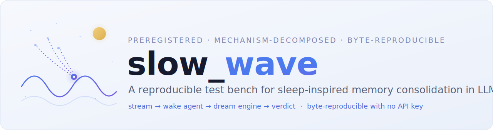
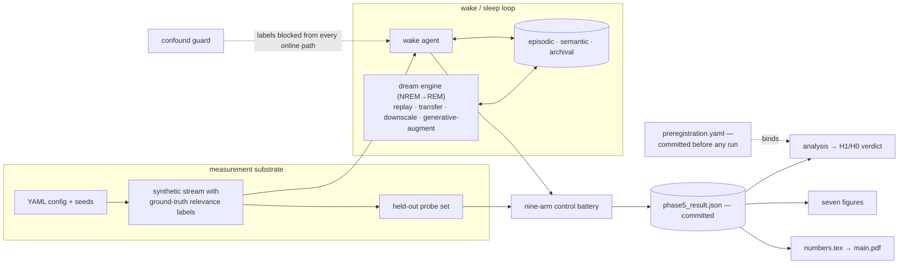

<a id="top"></a>

<div align="center">

<picture>
  <source media="(prefers-color-scheme: dark)" srcset="assets/banner-dark.svg">
  
</picture>

<br>

<!-- Honest badges only: the real CI workflow, the decided license, and the actually-committed preregistration. -->
[](https://github.com/JusHoya/slow_wave/actions/workflows/ci.yml)
[](LICENSE)
[](prereg/preregistration.yaml)

[Why](#why) · [Findings](#what-the-bench-found) · [Architecture](#architecture) · [Quickstart](#quickstart) · [Design guarantees](#design-guarantees) · [Roadmap](#roadmap) · [The paper](#the-paper) · [Collaborate](#collaborate) · [Cite](#how-to-cite) · [License](#license)

</div>

---

> A frozen-weights LLM agent gets a periodic, offline sleep/dream cycle. The bench measures — against known ground-truth relevance, under a committed preregistration — whether consolidation actually helps, what it costs, and what beats it.

**Slow Wave** is a reproducible research test bench for sleep-inspired memory consolidation in autonomous AI agents. Long-running agents ingest far more data than ever affects mission performance; biology answers the analogous problem with sleep — replaying recent experience, transferring episodic traces into durable semantic memory, and downscaling low-value synapses while protecting salient ones. Slow Wave engineers that cycle as four independently-ablatable operators, runs it inside a nine-arm preregistered control battery over synthetic streams whose every item carries a ground-truth relevance label, and reports the outcome — positive, negative, and cost-unfavourable alike — from committed data. The full specification lives in [`PRD.md`](PRD.md); this README is the front door.

> [!IMPORTANT]
> **Status: complete.** All seven roadmap rows — the spec baseline and Phases 0–6 — are shipped and merged: the labeled-stream measurement substrate (Phase 1), the dual-store memory and the no-sleep baseline that demonstrably forgets (Phase 2), the four-operator dream engine (Phase 3), the nine-arm harness bound to a committed preregistration (Phase 4), the executed 216-cell experiment grid with its analysis and seven figures (Phase 5), and the full IMRaD manuscript with audited citations and reproducibility appendices (Phase 6, including honesty revisions from an external red-team disposition). Every figure and every in-text paper number regenerates from the committed result in one command. What the study found — caveat first — is in [What the bench found](#what-the-bench-found).

## Why

Agent memory is shipping faster than agent-memory *science*. Production consolidation features fire reactively at token thresholds, bundle replay/summarize/prune into one non-ablatable behavior, and are evaluated — when they are evaluated — on downstream accuracy against a single baseline, with no ground truth for what *should* have been kept. Slow Wave is the counter-artifact: a scheduled, offline, mechanism-decomposed consolidation study in which every memory the agent holds has a known relevance label, so consolidation quality is measured directly instead of inferred.

| Without Slow Wave | With Slow Wave |
| --- | --- |
| Consolidation judged only by downstream accuracy | Prune **precision/recall/F1 against ground-truth relevance**, plus a salience-vs-relevance calibration curve, reported decoupled from accuracy |
| Bundled, non-ablatable memory behavior | Four independent operators (replay / transfer / downscale / generative-augment); all 2⁴ combinations run |
| Post-hoc analysis freedom (the garden of forking paths) | A preregistration committed before the runs; the analysis code **refuses** to compute a non-preregistered primary endpoint |
| One treatment vs. one baseline | A nine-arm battery: A/A noise floor, oracle prune ceiling, ground-truth-blind random-pruning negative control, long-context and reflection baselines |
| "Works with our API key" irreproducibility | A deterministic mock-LLM fallback: the whole grid, analysis, and figures reproduce byte-for-byte with **no API key** |
| Cherry-picked wins | Negative and cost-unfavourable findings reported with the same prominence as the confirmation |

## What the bench found

> [!WARNING]
> **Mechanism demonstration only.** Every number below was produced under the **deterministic mock LLM** in the synthetic fact-world stream (no `ANTHROPIC_API_KEY` present), which is what makes it reproducible bit-for-bit. The verdict is a statement about the bench mechanism in that regime — **not a claim about a real Claude model**, and the neuroscience is motivation and analogy, not a fidelity claim. This caveat rides on the paper's abstract, every figure caption, and [`paper/RESULTS.md`](paper/RESULTS.md).

- **The preregistered primary endpoint was confirmed in-regime.** Full dream cycle vs. no-sleep baseline, paired by seed in the distractor-heavy regime: ΔACC = **+0.379**, 95% CI [0.329, 0.429], Wilcoxon p = 0.014, n = 8 paired seeds, clearing the A/A noise floor of 0.063. The registered secondary contrast also held: full dream beats replay-only (+0.371).
- **And the cost story cuts the other way — reported as a first-class finding.** A simpler, deployable shallow-synthesis control (`reflection`) reaches higher accuracy at lower token cost than the full dream cycle, and the uncapped long-context baseline keeps the raw-accuracy lead at maximum memory cost, with **no cost-adjusted crossover** anywhere in the swept stream lengths (L = 2–12). Because realized budgets were not matched within tolerance, wins are reported on the accuracy-vs-compute Pareto frontier, not as matched-budget victories.
- **Replay targeting works as designed, but the benchmark comparison does not survive honesty review.** Prioritized replay moves signal into durable memory (mean signal-retention lift +0.28 for replay arms); its standardized margin (g = 1.70) over the human targeted-memory-reactivation benchmark (g = 0.29) is inflated by the mock's determinism and is not a meaningful comparison.
- **Accelerated sim-time preserves the arm ranking.** Sim-vs-real agreement shows no rank inversions (Spearman ρ = 1.00, Pearson r = 0.98), supporting the time-compression protocol within this regime.

The complete verdicts, tables, and negative-result mapping live in [`paper/RESULTS.md`](paper/RESULTS.md); the manuscript treats the cost-unfavourable patterns with the same rigor as the confirmation.

## Architecture

**Boundary rule: consolidation is gated to sleep, and ground-truth labels are physically unreachable from any online code path.** Semantic writes happen only inside a scheduled sleep window, and the confound guard proves by test that no retrieval or priority decision can ever peek at a relevance label — the labels exist solely so the *bench* can grade the agent afterwards.



The package owns the whole pipeline: `slow_wave.stream` (the deterministic generator, Gebru-style datasheet, probe sets, and the confound guard), `slow_wave.memory` (the episodic/semantic/archival substrate with salience, provenance, demote-don't-delete eviction, and write-protection), `slow_wave.agent` (the wake loop), `slow_wave.dream` (the four operators, sleep gating, and sleep-pressure control), `slow_wave.eval` (the nine arms, matched-budget controller, continual-learning + mechanism metrics, a pure-NumPy statistics suite, the grid runner, and the analysis), `slow_wave.repro` (seeding, git provenance, run manifests, the smoke bench), and `slow_wave.paper` (figures and the in-text number macros). The authoritative cross-module interface contract for each phase lives in [`docs/`](docs/).

## Quickstart

Four commands, all real and copy-pasteable today. Prerequisites: Python ≥ 3.11 (CI tests 3.11 and 3.12) — no API key, no GPU, no heavy ML stack.

```text
python -m venv .venv && source .venv/bin/activate   # Windows: .venv\Scripts\activate
pip install -e ".[dev]"                             # core + test deps only
python -m pytest                                    # the full suite, green with no key
make repro-phase5                                   # rerun the entire preregistered study
```

`make repro-phase5` executes the full arm × regime × seed grid, the stream-length sweep, and the sim-vs-real runs, then recomputes the analysis and regenerates every figure (figures need `pip install -e ".[viz]"` for matplotlib). Every phase has its own one-command reproduction — `repro-smoke`, `repro-stream`, `repro-agent`, `repro-dream`, `repro-eval`, `repro-phase5`, `repro-figures`, `repro-numbers`, `repro-paper` — and on Windows (no `make`) the [`Makefile`](Makefile) header documents the direct `python -m` equivalents. Setting `ANTHROPIC_API_KEY` switches LLM calls from the deterministic mock to a real Claude model; either way, every manifest records which one actually ran.

## Design guarantees

<!-- The invariants that make the result trustworthy. Each is enforced by code or CI, not left aspirational. -->
1. **Honesty by construction** — with no API key the bench runs on a deterministic, *flagged* mock LLM; every manifest records `model_mocked`, and the mechanism-demonstration caveat is stamped on the abstract, every figure caption, and the results file, so the regime can never be silently confused with a real-model claim.
2. **The analysis cannot p-hack** — [`prereg/preregistration.yaml`](prereg/preregistration.yaml) (H1/H0, the single primary endpoint, seed plan and power analysis, tests, rejection criteria, and six pre-specified negative-result forms) was committed before the experiment runs, and the analysis code refuses to compute a non-preregistered primary endpoint.
3. **No confounds by construction** — ground-truth relevance labels are unreachable from every online retrieval/priority code path, enforced and proven by a dedicated test (FR1.6).
4. **Byte-reproducible** — the same config and seeds under the mock produce byte-identical streams, manifests, results, and figures; CI runs the suite plus the smoke and stream reproductions with no secrets configured.
5. **Nothing silently dropped** — grid coverage (216/216 cells) is logged with no silent caps; eviction demotes to the archival tier rather than deleting; every consolidated item carries a provenance pointer back to its sources.
6. **Every reported number regenerates** — each in-text paper number is a generated macro ([`paper/generated/numbers.tex`](paper/generated/numbers.tex)) computed from the committed result, and the figures, numbers, and verdict each rebuild from that result in one command.

## Roadmap

Seven rows, each gated on red-team-checkable exit criteria (full detail in [`PRD.md` §8](PRD.md)) and each executed on its own branch. All are complete — this table is the honest record of what shipped:

| Phase | Scope | Exit criteria (summary) | Status |
| --- | --- | --- | --- |
| — | **Spec baseline** — full PRD: hypotheses, functional requirements, the nine-arm battery + preregistration design, pre-specified negative-result forms | Document set complete and internally consistent | Complete |
| 0 | **Foundations & reproducibility scaffolding** — repo, pinned deps, config loader, run-manifest writer, seeding, CI, hello-bench smoke run | Clean-checkout install; manifest schema test covers every provenance field; identical non-LLM outputs across reruns; one-command smoke | Complete |
| 1 | **Synthetic continual task stream generator** — ground-truth relevance labels, distractor regimes, CL-scenario tags, datasheet, held-out probes, confound guard | Seed-deterministic byte-identical streams; label/regime distribution tests; confound test proves labels unreachable online; datasheet schema-validated; well-formed `R[i,j]` vs. a trivial oracle | Complete |
| 2 | **Memory substrate + no-sleep baseline** — episodic/semantic/archival tiers, salience, provenance, write-protection; the wake agent | Store separation, provenance tracing, and demote-not-delete each proven by test; protection violations logged; the baseline demonstrably forgets (BWT < 0) | Complete |
| 3 | **Dream engine** — REPLAY, TRANSFER, DOWNSCALE, GENERATIVE-AUGMENT in a two-phase NREM→REM cycle with gating and sleep pressure | All 2⁴ operator combinations instantiate and run; decay-then-repotentiate verified; semantic writes gated to sleep; CLS interleaving removable; three swappable decay curves; provenance audit intact | Complete |
| 4 | **Eval harness, control battery & preregistration** — nine arms, matched-budget controller + Pareto, metrics, pure-NumPy statistics, bias controls | All nine arms run on one shared stream per seed; A/A noise floor and oracle ceiling verified; budget actuals recorded; preregistration committed with a git hash before any real run | Complete |
| 5 | **Experiments, analysis & plots** — the 216-cell grid, stream-length sweep, sim-vs-real runs, seven figures, the H1/H0 verdict | 216/216 cells with per-run manifests and no silent caps; 8 seeds ≥ the committed power floor; verdict computed exactly as preregistered; crossover reported or its absence stated; every figure regenerates from the committed result | Complete |
| 6 | **Scientific paper** — IMRaD manuscript, verified citations, datasheet / model-card / hyperparameter / reproducibility appendices | All IMRaD sections plus an explicit contributions list; every figure and number regenerable from committed manifests; every citation resolves ([audit committed](paper/CITATIONS_AUDIT.md)); limitations state the frozen-weights, sim-compression, and mock-LLM scope with no efficacy or biological-fidelity overclaim | Complete — including honesty revisions from an external red-team disposition |

## Data in, data out

- **In:** YAML — one config per experiment under [`configs/`](configs/), from `smoke.yaml` to the science-scale `phase5_full.yaml`, plus the seeds.
- **Out:** JSON manifests everywhere, and the committed study artifacts: [`phase5/phase5_result.json`](phase5/phase5_result.json) (the consolidated 216-cell grid — 9 arms × 3 regimes × 8 seeds — plus the length sweep and sim-vs-real curves), [`phase5/analysis.json`](phase5/analysis.json), the seven vector figures with their manifest under [`paper/figures/`](paper/figures/), and the human-readable [`paper/RESULTS.md`](paper/RESULTS.md).

Reading the committed result needs nothing but the standard library:

```python
import json

res = json.load(open("phase5/phase5_result.json"))
res["model_mocked"]          # True — the honesty flag every consumer must respect
res["git_commit"]            # the exact code state that produced this result
res["grid"]["arms"]          # the nine arms of the control battery
res["analysis"]["headline"]  # the verdict as one sentence, caveat included
```

## The paper

Phase 6 delivers the complete manuscript — *Slow Wave: A Mechanism-Decomposed Test Bench for Sleep-Inspired Memory Consolidation in Continual-Learning LLM Agents* — as LaTeX source under [`paper/`](paper/): IMRaD sections from introduction through limitations, reproducibility, and conclusion, with four appendices (a Gebru et al. datasheet, a model card, hyperparameters + prompts, and a reproducibility statement anchored to the NeurIPS checklist). Every in-text results number is an `\input` macro regenerated from the committed Phase 5 result, every figure is regenerated by the figures module, and every citation was audited against a locatable source ([`paper/CITATIONS_AUDIT.md`](paper/CITATIONS_AUDIT.md)). The PDF is deliberately not committed — it is a build artifact: `make repro-paper` regenerates numbers and figures from the committed result and compiles `paper/main.pdf` on a stock TeX distribution (the preamble is venue-agnostic `article` class, so a venue style file is a one-line swap).

## Collaborate

Slow Wave is one instrument pointed at one corner of a much larger question: **how should a long-lived agent decide what to remember?** If you are researching AGI — agent memory, continual learning, sleep-inspired computation, or evaluation methodology — collaboration is explicitly invited, and the bench was built to be extended rather than admired:

- **Replicate under a real model.** Set `ANTHROPIC_API_KEY` and rerun the grid. Whether these mechanism results survive contact with a real LLM is the single most valuable experiment this repository enables, and it is one command.
- **Add an arm or an operator.** The phase contracts in [`docs/`](docs/) specify every interface; a new consolidation policy is a config entry plus a class, and it inherits the full metric, statistics, and budget machinery.
- **Attack the preregistration.** H1, H0, the rejection criteria, and six pre-specified negative-result forms are committed. Refuting the confirmed endpoint in a regime the sweep did not cover is a welcome contribution, not a threat.
- **Swap the world.** The synthetic fact-world is one stream generator behind a contract — port a stream from your own domain and keep the entire instrument, ground-truth grading included.

Open a [GitHub issue](https://github.com/JusHoya/slow_wave/issues) to start a thread — anything from a five-minute question to a co-authored follow-up study is in scope.

## How to cite

Citation metadata lives in [`CITATION.cff`](CITATION.cff); the BibTeX block below mirrors it field for field.

```bibtex
@software{hoyer_slow_wave,
  author  = {Hoyer, III, Melvin},
  title   = {Slow Wave: a mechanism-decomposed test bench for sleep-inspired
             memory consolidation in continual-learning LLM agents},
  year    = {2026},
  url     = {https://github.com/JusHoya/slow_wave},
  version = {0.1.0}
}
```

## License

Apache License 2.0 — see [`LICENSE`](LICENSE). Chosen over MIT for its explicit patent grant, so the [collaboration](#collaborate) this repository invites rests on unambiguous terms.

## FAQ

<details>
<summary><b>Are these results claims about a real Claude model?</b></summary>

No — and the bench is built so that confusion is impossible. Every committed number was produced under the deterministic mock LLM (no API key in the environment); every manifest records `model_mocked`; and the mechanism-demonstration caveat is stamped on the paper's abstract, every figure caption, and `paper/RESULTS.md`. To test a real model, set `ANTHROPIC_API_KEY` and rerun the grid — the manifests will record exactly what ran.

</details>

<details>
<summary><b>So did the sleep cycle win or not?</b></summary>

Both findings are true and both are reported. On the preregistered primary endpoint, the full dream cycle beats the no-sleep baseline decisively in-regime (+0.379 paired ΔACC, clearing the A/A noise floor). On the cost frontier, it loses: the simpler `reflection` control reaches higher accuracy at lower token cost, and uncapped long-context holds the raw-accuracy lead at maximum memory cost with no crossover in the swept lengths. A practitioner should read the second finding as seriously as the first — that is why it is in the abstract, not a footnote.

</details>

<details>
<summary><b>Why design around a mock LLM at all?</b></summary>

Determinism and honesty. The mock makes the entire study byte-reproducible on any machine with no key and no cost, keeps CI green without secrets, and lets a skeptic regenerate every figure and number from the committed result in minutes. The trade — clearly labeled everywhere — is that the results characterize the bench mechanism, not a production model. The real-model run is deliberately left as the cheapest possible replication for anyone who wants to close that gap.

</details>

<details>
<summary><b>Why frozen weights?</b></summary>

Because that is the deployment reality: production agents generally cannot fine-tune per mission. The scientific question is whether memory-level consolidation *alone* — replay, transfer, downscaling, augmentation over an external store — can carry a continual-learning effect when the weights never move. That is also what makes the result actionable for anyone building agents today.

</details>

<details>
<summary><b>Is the paper peer-reviewed?</b></summary>

No. It is a preprint-grade manuscript: red-teamed internally against the PRD's exit criteria, revised against an external red-team disposition (which is where the honesty-tightened framing of the TMR comparison and the budget-matching caveat came from), with every citation audited. It compiles on a stock TeX distribution with the venue-agnostic `article` class, so a venue submission is a preamble swap away.

</details>

<details>
<summary><b>Why the name "Slow Wave"?</b></summary>

Slow-wave sleep is the deep NREM stage in which biology is thought to do replay-driven consolidation and synaptic downscaling — precisely the two mechanisms the dream engine decomposes into independently testable operators. The neuroscience is the motivation and the naming scheme, never a fidelity claim.

</details>

---

<div align="center">
<sub>A research instrument for measured, preregistered agent-memory science. · <a href="#top">back to top ↑</a></sub>
</div>
